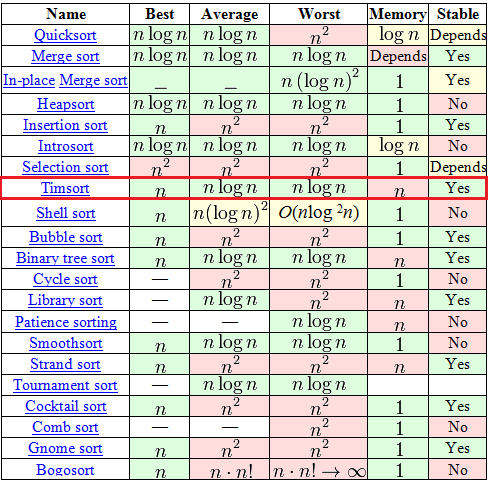

> 1. Make it Work.
> 2. Make it Right.
> 3. Make it Fast.

很多语言的排序算法都采用 Timesort，很值得学习。

[toc]

---

# 1 归并排序

## 1.1 测试样例

根据函数的实现，选取不同的测试样例。

### 1.1.1 无返回值

```rust
#[cfg(test)]
mod tests {
    use super::*;

    #[test]
    fn basic() {
        let mut res = vec![10, 8, 4, 3, 1, 9, 2, 7, 5, 6];
        merge_sort(&mut res);
        assert_eq!(res, vec![1, 2, 3, 4, 5, 6, 7, 8, 9, 10]);
    }

    #[test]
    fn basic_string() {
        let mut res = vec!["a", "bb", "d", "cc"];
        merge_sort(&mut res);
        assert_eq!(res, vec!["a", "bb", "cc", "d"]);
    }

    #[test]
    fn empty() {
        let mut res = Vec::<u8>::new();
        merge_sort(&mut res);
        assert_eq!(res, vec![]);
    }

    #[test]
    fn one_element() {
        let mut res = vec![1];
        merge_sort(&mut res);
        assert_eq!(res, vec![1]);
    }

    #[test]
    fn pre_sorted() {
        let mut res = vec![1, 2, 3, 4];
        merge_sort(&mut res);
        assert_eq!(res, vec![1, 2, 3, 4]);
    }

    #[test]
    fn reverse_sorted() {
        let mut res = vec![4, 3, 2, 1];
        merge_sort(&mut res);
        assert_eq!(res, vec![1, 2, 3, 4]);
    }
}
```


### 1.1.2 有返回值

```rust
#[cfg(test)]
mod tests {
    use super::*;

    #[test]
    fn basic() {
        let mut res = vec![10, 8, 4, 3, 1, 9, 2, 7, 5, 6];
        let res = merge_sort(&mut res);
        assert_eq!(res, vec![1, 2, 3, 4, 5, 6, 7, 8, 9, 10]);
    }

    #[test]
    fn basic_string() {
        let mut res = vec!["a", "bb", "d", "cc"];
        let res = merge_sort(&mut res);
        assert_eq!(res, vec!["a", "bb", "cc", "d"]);
    }

    #[test]
    fn empty() {
        let mut res = Vec::<i32>::new();
        let res = merge_sort(&mut res);
        assert_eq!(res, vec![]);
    }

    #[test]
    fn one_element() {
        let mut res = vec![1];
        let res = merge_sort(&mut res);
        assert_eq!(res, vec![1]);
    }

    #[test]
    fn pre_sorted() {
        let mut res = vec![1, 2, 3, 4];
        let res = merge_sort(&mut res);
        assert_eq!(res, vec![1, 2, 3, 4]);
    }

    #[test]
    fn reverse_sorted() {
        let mut res = vec![4, 3, 2, 1];
        let res = merge_sort(&mut res);
        assert_eq!(res, vec![1, 2, 3, 4]);
    }

    #[test]
    fn test_sort() {
        let mut res = vec![7, 49, 73, 58, 30, 72, 44, 78, 23, 9];
        let res = merge_sort(&mut res);
        assert_eq!(res, vec![7, 9, 23, 30, 44, 49, 58, 72, 73, 78]);
    }
}

```


## 1.2 归并排序-伪代码

```python
mergesort(array a)
    if (n == 1)
        return a

    arrayOne = a[0]...a[n/2]
    arrayTwo = a[n/2+1]..a[n]

    arrayOne = mergesort(arrayOne)
    arrayTwo = mergesort(arrayTwo)

    return merge(arrayOne, arrayTwo)

merge(array a, array b)
    array c

    while (a and b have elements)
        if (a[0] > b[0])
            add b[0] to the end of c
            remove b[0] from b
        else
            add a[0] to the end of c
            remove a[0] from a
    
    while (a has elements)
        add a[0] to the end of c
        remove a[0] from a
```


## 1.3 算法实现-最利于理解、有返回值

尽可能还原伪代码
```rust
pub fn merge_sort(arr: &mut Vec<i32>) -> Vec<i32> {
    if arr.len() == 0 || arr.len() == 1 {
        return arr.to_vec();
    }
    let mid = arr.len() / 2;

    let mut left_arr = arr[..mid].to_vec();
    let mut right_arr = arr[mid..].to_vec();
    let mut left_arr = merge_sort(&mut left_arr);
    let mut right_arr = merge_sort(&mut right_arr);

    return merge(&mut left_arr, &mut right_arr);
}

fn merge(left_arr: &mut Vec<i32>, right_arr: &mut Vec<i32>) -> Vec<i32> {
    let mut new_arr = vec![];

    while left_arr.len() > 0 && right_arr.len() > 0 {
        if left_arr[0] > right_arr[0] {
            new_arr.push(right_arr[0]);
            right_arr.remove(0);
        } else {
            new_arr.push(left_arr[0]);
            left_arr.remove(0);
        }
    }

    while left_arr.len() > 0 {
        new_arr.push(left_arr[0]);
        left_arr.remove(0);
    }

    while right_arr.len() > 0 {
        new_arr.push(right_arr[0]);
        right_arr.remove(0);
    }

    return new_arr.to_vec();
}
```

## 1.4 算法实现-使用泛型优化、有返回值

```rust
pub fn merge_sort<T: Copy + Ord>(arr: &mut Vec<T>) -> Vec<T> {
    if arr.len() == 0 || arr.len() == 1 {
        return arr.to_vec();
    }
    let mid = arr.len() / 2;

    let mut left_arr = arr[..mid].to_vec();
    let mut right_arr = arr[mid..].to_vec();
    let mut left_arr = merge_sort(&mut left_arr);
    let mut right_arr = merge_sort(&mut right_arr);

    return merge(&mut left_arr, &mut right_arr);
}

fn merge<T: Copy + Ord>(left_arr: &mut Vec<T>, right_arr: &mut Vec<T>) -> Vec<T> {
    let mut new_arr = vec![];

    while left_arr.len() > 0 && right_arr.len() > 0 {
        if left_arr[0] > right_arr[0] {
            new_arr.push(right_arr[0]);
            right_arr.remove(0);
        } else {
            new_arr.push(left_arr[0]);
            left_arr.remove(0);
        }
    }

    while left_arr.len() > 0 {
        new_arr.push(left_arr[0]);
        left_arr.remove(0);
    }

    while right_arr.len() > 0 {
        new_arr.push(right_arr[0]);
        right_arr.remove(0);
    }

    return new_arr.to_vec();
}
```

## 1.5 算法实现-传引用

```rust
// 注意区分 Vec<T> 和 [T]
pub fn merge_sort<T: Copy + Ord + Default>(arr: &mut [T]) {
    if arr.len() == 0 || arr.len() == 1 {
        return;
    }
    let mid = arr.len() / 2;

    let mut left_arr = merge_sort(&mut arr[..mid]);
    let mut right_arr = merge_sort(&mut arr[mid..]);

    return merge(arr, mid);
}

// 不能同时有两个可变引用，所以使用 arr, mid
fn merge<T: Copy + Ord + Default>(arr: &mut [T], mid: usize) {
    let mut left_arr = arr[..mid].to_vec();
    let mut right_arr = arr[mid..].to_vec();

    let (mut i, mut j) = (0, 0);
    while i < left_arr.len() && j < right_arr.len() {
        if left_arr[i] < right_arr[j] {
            // 需要实现 Default Trait
            arr[i + j] = std::mem::take(&mut left_arr[i]);
            i += 1;
        } else {
            arr[i + j] = std::mem::take(&mut right_arr[j]);
            j += 1;
        }
    }

    while i < left_arr.len() {
        arr[i + j] = std::mem::take(&mut left_arr[i]);
        i += 1;
    }

    while j < right_arr.len() {
        arr[i + j] = std::mem::take(&mut right_arr[j]);
        j += 1;
    }
}

```


## 1.6 算法实现-优化合并过程

非常惊艳的写法，Orz。for 循环设计真巧妙。
```rust
// 注意区分 Vec<T> 和 [T]
pub fn merge_sort<T: Copy + Ord + Default>(arr: &mut [T]) {
    // 只有当元素个数大于一时才进行排序
    if arr.len() > 1 {
        let mid = arr.len() / 2;
        // 递归排序左边数组
        let mut left_arr = merge_sort(&mut arr[..mid]);
        // 递归排序右边数组
        let mut right_arr = merge_sort(&mut arr[mid..]);
        // 合并
        return merge(arr, mid);
    }
}

// 不能同时有两个可变引用，所以使用 arr, mid
fn merge<T: Copy + Ord + Default>(arr: &mut [T], mid: usize) {
    let mut left_arr = arr[..mid].to_vec();
    let mut right_arr = arr[mid..].to_vec();
    // 数组索引
    let (mut l, mut r) = (0, 0);
    for v in arr {
        // 这里的顺序不能交换。如果交换顺序，右侧全部 push 之后，r 会超过 right_arr.len，会导致越界错误
        if r == right_arr.len() || (l < left_arr.len() && left_arr[l] < right_arr[r]) {
            *v = left_arr[l];
            l += 1;
        } else {
            *v = right_arr[r];
            r += 1;
        }
    }
}
```

## 1.7 归并算法小结

- 多琢磨重复的 while 循环，可以找到一些巧妙的写法，这些写法很精妙。
- TODO：为什么需要实现 Default？

# 2 插入排序

## 2.1 测试样例

```rust
#[cfg(test)]
mod tests {
    use super::*;

    #[test]
    fn test_empty_vec() {
        let mut empty_vec: Vec<String> = vec![];
        insertion_sort(&mut empty_vec);
        assert_eq!(empty_vec, Vec::<String>::new());
    }

    #[test]
    fn test_number_vec() {
        let mut vec = vec![7, 49, 73, 58, 30, 72, 44, 78, 23, 9];
        insertion_sort(&mut vec);
        assert_eq!(vec, vec![7, 9, 23, 30, 44, 49, 58, 72, 73, 78]);
    }

    #[test]
    fn test_string_vec() {
        let mut vec = vec![
            String::from("Bob"),
            String::from("David"),
            String::from("Carol"),
            String::from("Alice"),
        ];
        insertion_sort(&mut vec);
        assert_eq!(
            vec,
            vec![
                String::from("Alice"),
                String::from("Bob"),
                String::from("Carol"),
                String::from("David"),
            ]
        );
    }
}

```

## 2.2 伪代码

```
for i: 1 to length(A) - 1
    j = 1
    while j > 0 and A[j - 1] > A[j]
        swap A[j] and A[j - 1]
        j = j - 1
```


## 2.3 算法实现-最利于理解

```rust
fn insertion_sort(arr: &mut [i32]) {
    // 1 to length(arr) - 1
    for i in 1..arr.len() {
        let mut j = i;
        while j > 0 && arr[j - 1] > arr[j] {
            arr.swap(j - 1, j);
            j = j - 1;
        }
    }
}
```

## 2.4 算法实现-泛型

```rust
fn insertion_sort<T: Ord>(arr: &mut [T]) {
    // 1 to length(arr) - 1
    for i in 1..arr.len() {
        let mut j = i;
        while j > 0 && arr[j - 1] > arr[j] {
            arr.swap(j - 1, j);
            j = j - 1;
        }
    }
}
```

## 2.5 算法实现-二分优化搜索过程

上面的代码很简洁。~~但有个不足之处——while 循环的效率很低，可以采用二分来优化~~

数组的遍历是指针操作，所以不用二分也行。


## 2.6 插入排序小结

- 有序的查找过程，可以使用二分搜索优化。
- 排序算法可以和搜索算法结合（二叉树），效率++

# 3 Timsort 排序

## 3.1 测试样例

```rust
#[cfg(test)]
mod tests {
    use super::*;

    #[test]
    fn basic() {
        let mut array = vec![-2, 7, 15, -14, 0, 15, 0, 7, -7, -4, -13, 5, 8, -14, 12];
        let arr_len = array.len();
        tim_sort(&mut array);
        for i in 0..array.len() - 1 {
            assert!(array[i] <= array[i + 1]);
        }
    }

    #[test]
    fn empty() {
        let mut array = Vec::<i32>::new();
        let arr_len = array.len();
        tim_sort(&mut array);
        assert_eq!(array, vec![]);
    }

    #[test]
    fn one_element() {
        let mut array = vec![3];
        let arr_len = array.len();
        tim_sort(&mut array);
        assert_eq!(array, vec![3]);
    }

    #[test]
    fn pre_sorted() {
        let mut array = vec![0, 1, 2, 3, 4, 5, 6, 7, 8, 9];
        let arr_len = array.len();
        tim_sort(&mut array);
        assert_eq!(array, vec![0, 1, 2, 3, 4, 5, 6, 7, 8, 9]);
    }

    #[test]
    fn test_empty_vec() {
        let mut empty_vec: Vec<&str> = vec![];
        tim_sort(&mut empty_vec);
        assert_eq!(empty_vec, Vec::<String>::new());
    }

    #[test]
    fn test_string_vec() {
        let mut vec = vec![
            String::from("Bob"),
            String::from("David"),
            String::from("Carol"),
            String::from("Alice"),
        ];
        insertion_sort(&mut vec);
        assert_eq!(
            vec,
            vec![
                String::from("Alice"),
                String::from("Bob"),
                String::from("Carol"),
                String::from("David"),
            ]
        );
    }

    #[test]
    fn test_number_vec() {
        let mut vec = vec![7, 49, 73, 58, 30, 72, 44, 78, 23, 9];
        tim_sort(&mut vec);
        assert_eq!(vec, vec![7, 9, 23, 30, 44, 49, 58, 72, 73, 78]);
    }
}

```

## 3.2 伪代码


Tim Peters 结合了 `merge sort` 和 `insertion sort` 的优点来优化算法，小片段合并采用插入，形成大片段后采用归并。这里简化了扫描数组的部分，关注于后续的插入算法和归并算法结合的过程：
```

```

完整版步骤：
```
1. 扫描数组，确定其中的单调上升段和严格单调下降段，将严格下降段反转；
2. 定义最小基本片段长度，短于此的单调片段通过插入排序集中为长于此的段；
3. 反复归并一些相邻片段，过程中避免归并长度相差很大的片段，直至整个排序完成，所用分段选择策略可以保证O(n log n)时间复杂性。 
```

## 3.3 算法实现-最容易理解的版本

固定基本片段长度：

```rust
// insertion_sort 和 merge 分别来自上文的插入排序和归并排序。
use super::insertion_sort::insertion_sort;
use super::merge_sort::merge;

fn tim_sort<T: Ord + Copy + Default>(arr: &mut [T]) {
    let length = arr.len();
    if length <= 1 {
        return;
    }
    let minrun = 5;

    let mut size = minrun;
    loop {
        insertion_sort(&mut arr[(size - minrun)..size]);
        if size + minrun >= length {
            insertion_sort(&mut arr[size..length]);
            break;
        }
        size += minrun;
    }

    let mut size = minrun;
    loop {
        merge(&mut arr[..size], size - minrun);
        if size + minrun >= length {
            merge(arr, size);
            break;
        }
        size += minrun;
    }
}
```


## 3.4 算法实现-最小长度确定

最小长度的要求：
1. 不能太长。数组长度为 200，minrun 为 2000，这样整个算法就成为插入排序了。
2. 不能太短。数组长度为 200，minrun 为 1，整个算法就成为归并算法了。

解决方案：设置一个 MIN 长度，然后让数组长度来靠近这个 MIN（通过除 2）。minrun 和 length 为 2 的指数能提高归并的效率，在后面再优化归并算法。


# 效率




https://zhuanlan.zhihu.com/p/342227727


# 参考文章

- https://www.youtube.com/watch?v=4VqmGXwpLqc
- https://www.youtube.com/watch?v=JU767SDMDvA
- https://www.geeksforgeeks.org/timsort/
- https://www.zhihu.com/question/23928138
- https://www.infopulse.com/blog/timsort-sorting-algorithm