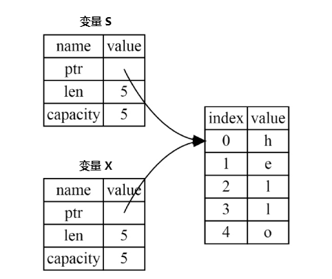

读书笔记

[toc]

# 1 入门指南

## 1.1 简介

为什么要使用 Rust？

可以让每个人编写可靠且高效的软件，让很多 bug 在编译时就能被消灭。
擅长：
- 运行速度
- 内存安全
- 多处理器

比较 C/C++，类型和内存不安全。
比较 Java/C#，保证内存安全，但性能不行。
Rust：
- 安全
- 无需GC
- 易于维护和调试。

Rust 特别擅长：
- 高性能 Web Service
- WebAssembly
- 命令行工具
- 网络编程
- 嵌入式设备
- 系统编程

Rust 用户：
- Google：Fuschia 的 Rust 代码占用 30%。
- Amazon：基于 Linux 开发的直接可以在裸机、虚拟机上运行容器的操作系统。
- System76：下一代操作系统 Redox。

Rust 优点：
- 性能
- 安全性
- 无所畏惧的并发
Rust 缺点：
- 难学。相对于 C++ 很简单……

注意：
- 学习 Rust 有很多独有概念，最好不要跳跃性的学习。

## 1.2 安装 Rust

更新 rust：rustup update
验证安装：rustc --version

本地文档 rustup doc

开发工具：IntelLij IDEA Rust 插件、VScode-rust

## 1.3 Hello World

fn main(){} ，无参数无返回值。

println! 是一个 Macro（宏）。
rust 的缩进是4个空格，不是 tab。

在Windows中会生成 .pdb 文件，包含调试信息。

Rust 是 ahead-of-time 编译的语言，可以先编译程序，把文件发给别人即可运行，无需安装 Rust。

rustc 只适合简单的 Rust 程序。大型程序应该使用 cargo。

## 1.4 cargo

cargo 是rust 的构建系统和包安装工具。

cargo new --vcs 设置版本控制工具。

cargo.toml 是 cargo 配置格式。
- [pacakge] 标题。
- [dependencies] 依赖项

Rust 中代码库叫做 crate。

如果项目没有使用 cargo，也可转换为使用 cargo。
- 移动源码到 src 下。
- 创建 Cargo.toml

编译运行
- cargo build
  - target/debug
- cargo run：构建并且运行项目。
- cargo check：检查代码，运行效率比 build 快，可以连续反复调用 check 命令。
- cargo build --release：
  - target/release


# 2 猜数游戏

## 2.1 一次猜测

## 2.2 生成神秘数字

可重现的 build
- cargo update
- cargo build

完成 guessing game 代码，在 code 目录。

# 3 数据类型

## 3.1 变量与可变性

- 变量默认不可变。
- 使用mut改变可变性。
- 常量：const
- shadowing：覆盖变量，和mut不同，可以改变变量类型。
  
## 3.2 数据类型


- 标量：代表单个值
  - 整数类型.byte:b'A'。发布情况不会溢出，而是环绕。默认 i32
  - 浮点类型，f64 默认。
  - 布尔类型
  - 字符类型：unicode大小，char 可以放入 emoji

## 3.3 数据类型：复合类型
- 复合类型
  - 元组（Tuple）：解构获取值、点标记法、
  - 数组：数组所有值类型必须相同、Vector 比数组用得多。let a:[i32; 5] 声明数组、不允许越界访问

## 3.4 函数与注释
- 函数
  - 蛇皮命名法 snake case
  - parameter 形参、argument 实参（具体值）
  - Rust 是基于表达式的语言
  - 语句没有返回值，表达式有返回值。
  - 在->符号后声明函数返回值类型。
- 注释
  - //
  - /**/

## 3.5 控制流：if else

与条件相关联的代码块叫做分支（arm）。必须使用bool类型。

当分支过多，可以考虑使用 match。

if语句可以作为表达式。

## 3.6 循环

loop、可以使用break来停止循环。

while 每次都要判断一次条件。

数据通常使用 for 来遍历，while容易出错。在 rust 中用的最多。

range可以生成某个范围内的数据（1..4）=>1, 2, 3。

# 4 所有权

## 1、所有权存在的原因

用于**管理 heap 上的数据**。Rust 没有 gc，因此引入了另一种管理堆内存的方式，即标注所有权。

## 2、所有权的规则是什么？

类似《牛顿三大定律》一样，Rust 团队将众多内存的使用规则浓缩成几条规则，人们只需要准寻这几条规则即可写出非常稳定可靠的代码，当然这些规则也会体现在编译器中：
1. 每个值都有一个变量名，这个变量名是该值的所有者。如：`let x=1;`
2. **每个值同时只能有一个所有者**。
3. 当所有者超出作用域时（生命周期结束），该值被删除。

## 3、从 String 类型看所有权

**字符串字面值（str）**：程序里面手写的那些字符串值，它们是不可变的。
> PS：String 类型比标量类型复杂，通常存储在堆上。不同于 str 类型，String 类型可变长，可修改。

在 Rust 中，当某个变量生命周期结束，其值的内存会立即释放。
```rust
fn main() {
    let mut s = String::from("hello");
    s.push_str(", world!"); // push_str() 函数向String空间的尾部添加了一段字面量
    println!("{}", s); // 这里会输出完整的 hello, world!
    // 自动调用 drop 函数
}
```
其中 s 变量拥有 "hello" 内存的所有权，可以向尾部添加数据让其变成 "hello world"，当 s 变量离开作用域，"hello world!" 也会被回收。

简而言之，**所有权**就是堆内存的控制权限。

---

我们需要区别两个概念，值和变量是两个不同的东西。变量只是一个**名称**，指向一段内存（堆或者栈）。值通常指一段**内存里面的数据**。
```
s 变量 --拥有所有权--> "hello" 内存
```
通常有下面这些规律：
1. 变量拥有值得所有权。
2. 变量的生命周期结束，值也会被释放。

## 4、什么是所有权转移？

我们所说的**所有权转移**，也就是**将内存的控制权转移**。下面我们将变量 s 的所有权转移给变量 x：
```rust
fn main() {
    let mut s = String::from("hello");
    // s 变量 --拥有所有权--> "hello" 内存
    println!("{}", s); 

    let x = s;
    // x 变量 --拥有所有权--> "hello" 内存
    println!("{}", x); 

    // println!("{}", s); 
    // error: value borrowed here after move
}
```

控制权转移类似其他语言的浅拷贝，但**不完全一样**。



在 Rust 中控制权转移之后，会将前一个变量 s 设置为无效。其他语言的浅拷贝后前后两个变量都可以操作堆内存。因此在 Rust 中，所有权的转移称为 `move`。
> PS：Rust 不会自动创建数据的深拷贝，深拷贝太耗费资源了。另外，Rust 中的深拷贝叫做克隆。


## 5、克隆与复制

**所有权转移、克隆、复制都可以把值传递给变量**。

所有权太头大？来试试复制吧（doge
1. 克隆：完整的复制一份值，通常在堆上使用。
2. 复制：类似克隆，但只能在栈上使用（只有标量类型可以使用）。
> PS：适当的使用所有权，生活更美好。使用克隆和复制，可以不用考虑所有权的转移，不过可能会导致性能问题。
---

克隆：我们可以用克隆来解决上面最后的 error
```rust
fn main() {
    let mut s = String::from("hello");
    // s 变量 --拥有所有权--> "hello" 内存
    println!("{}", s); 

    let x = s.clone();
    // x 变量 --拥有所有权--> 另一份 "hello" 内存
    println!("{}", x); 

    println!("{}", s); 
}
```
克隆这种行为的 Trait 名称叫做 `Clone`。

---

**复制**
```rust
fn main() {
    let s = 1;
    let x = s;

    println!("{} {}", s, x);

}
```
复制这种行为的 Trait 名称叫做 `Copy`。

`Copy` Trait 有下面这些特点：
1. 如果一个类型实现了这个 Trait，那么旧的变量在赋值之后依然可用。如上所示，i32 类型就实现了 `Copy` Trait。
2. 如果类型实现了 `Drop` Trait，那么 Rust 就不允许该类型实现 `Copy` Trait。
3. 任何标量的组合类型都可以实现了 `Copy` Trait，但如果需要分配内存的类型都不可以实现 `Copy` Trait。

参考文章：https://zhuanlan.zhihu.com/p/21730929

## 6、所有权与函数

**将值传递给函数**和**将值赋给变量**是类似的行为。
```rust
fn main() {
    let s = String::from("Hello World");
    take_ownership(s);// s 的所有权转移给 some_string

    let x = 5;
    makes_copy(x);
    println!("x: {}", x);

}

fn take_ownership(some_string: String){
    println!("{}", some_string);
}// Rust 调用 Drop，回收 some_string 的内存

fn makes_copy(some_number: i32){
    println!("{}", some_number);
}
```
函数在返回值的过程也会发生所有权的转移 `move`：
```rust
fn main() {
    let s1 = give_ownership();

    let s2 = String::from("World");

    let s3 = takes_and_gives_back(s2);
}

fn give_ownership() -> String {
    let some_string = String::from("Hello");
    some_string
}

// 将 "World" 的所有权移动到 a_string
fn takes_and_gives_back(a_string: String) -> String {
    a_string
} // 不调用 drop，清理变量名。
// 将 a_string 的所有权移动到 s3
```

## 7、引用

可以把内存看成实体书，把值看成书里面的内容，变量名看成人名。
1. 所有权转移：把书卖给别人。
2. **引用**：把书给别人看一眼（函数调用的整个过程），别人可以把书里面的内容写成新的文章（函数可以）。别人借书的过程（引用的过程）叫做**借用**。

```rust
fn main() {
    let mut s1 = String::from("hello");
    // 借用 s1
    let len = calculate_length(&s1);    // 复制
    // 借用结束
    s1.push_str("world");
    println!("The length of '{}' is {}.", s1, len);
}

fn calculate_length(s: &String) -> usize {
    // 利用借用的值创建新的内容
    let some_string = format!("{}", s);
    println!("hi: {}", some_string);

    s.len()
}
```

把书借给别人，默认情况下是不允许乱涂乱画的（在借用过程中，不能修改书的内容）
```rust
fn main() {
    let mut s1 = String::from("hello");
    // 借用 s1
    let (s2, len) = calculate_length(&s1);    
}

fn calculate_length(s: &String) -> (&String, usize) {
    // s.push_str("world");    // 会报错

    (s, s.len())
}
```

在借用的时候取得了作者的授权后，才可以修改书中的内容。
```rust
fn main() {
    let mut s1 = String::from("hello");
    // 借用 s1
    let (s2, len) = calculate_length(&mut s1);
    println!("this is s2: {}", s2);    
}

fn calculate_length(s: &mut String) -> (&String, usize) {
    s.push_str(" world");

    (s, s.len())
}
```

书在某一个时间内，只能有一个人能修改书中的内容：
> 在特定的作用域内，对某一块数据，只能有一个可变引用。
```rust
fn main() {
    let mut s1 = String::from("hello");
    // 可变借用 s1
    let s2 = &mut s1;
    // 可变借用 s1
    let s3 = &mut s1;   // 由于 s3 和 s2 的借用的作用域重合，因此这里会报错
 
    s2.push_str("123");
    s3.push_str("456");

    // s2 借用结束
    // s3 借用结束
}
```

调整一下作用域的范围，即可正常编译通过：
```rust
fn main() {
    let mut s1 = String::from("hello");
    // 可变借用 s1
    let s2 = &mut s1;
    s2.push_str("123");
    // s2 借用结束

    // 可变借用 s1
    let s3 = &mut s1;   // 在特定的作用域内，对某一块数据，只能有一个可变引用。
    s3.push_str("456");
    // s3 借用结束
}
```

需要注意的是，函数可能返回一个引用，这就会导致原变量一直不可变
> PS：书借给了别人，作者就不能继续给书里添加内容了。因此**尽量不把引用传回来**。
```rust
fn main() {
    let mut s1 = String::from("hello");
    // 借用 s1
    let (s2, len) = calculate_length(&s1);    // s2 引用 s1，len 通过复制传递值
    
    // s1.push_str("world"); // 会报错。

    println!("The length of '{}' is {}.", s1, len);
    println!("this is s2 {}.", s2);
    // 借用结束
}

fn calculate_length(s: &String) -> (&String, usize) {
    (s, s.len())
}
```
书只有一本，借给别人看的同时，不能再修改书中的内容，即使是所有者也不能修改。
> PS：不可以同时拥有可变引用和不可变引用

---

当然上面的比喻并不是完美的，只是为了便于入门时的理解。

**特例 1**：书只能同时借给一个人。但在 Rust 中不可变借用可以同时借给多个变量。
> 可以看成利用投影仪把书投影给多个人看。又因为书放在投影仪中，所以投影过程中不能修改书的内容。
```rust
fn main() {
    let mut s1 = String::from("hello");
    // 借用 s1
     
    let s2 = &s1;
    let s3 = &s2;

    // s1.push_str("world"); // 会报错。

    println!("{} {} {}", s1, s2, s3);
}
```


---

总结一下引用的规则：（在任何时刻，只能满足下列条件之一）
1. 一个可变的引用。
2. 任意数量的可变引用。
> 上面的这些规则可以保证 Rust 的引用不会成为悬垂引用。

## 7、可变引用转移所有权了吗？

可变引用只是暂时转移所有权，当引用结束所有权会回到拥有者。

`move` 会将永久转移所有权，并且让旧变量失效。

## 8、数组中的引用：切片

切片是一种**不持有所有权的数据类型**（相当于视图），即 `&str`。

例题：返回字符串的第一个单词（字符串可能被修改，保持第一个单词和字符串同步）
```rust
fn main() {
    let mut s = String::from("Hello World");
    let word = first_word(&s);

    println!("{}", word);
}

fn first_word(s: &String) -> &str{
    let bytes = s.as_bytes();

    for (i, &item) in bytes.iter().enumerate(){
        if item == b' '{
            return &s[..i];
        }
    }
    &s[..]
}
```
字符串字面值就是切片 `&str`，因此使用 `&str` 更通用。
> **小技巧：使用 &str 作为参数类型，可以同时接收 String 类型和 &str 类型的参数**。
```rust
fn main() {
    let mut s = String::from("Hello World");
    let word = first_word(&s);
    println!("{}", word);

    let mut s = "Love Rust";
    let word = first_word(&s);

    println!("{}", word);
}

fn first_word(s: &str) -> &str{
    let bytes = s.as_bytes();

    for (i, &item) in bytes.iter().enumerate(){
        if item == b' '{
            return &s[..i];
        }
    }
    &s[..]
}
```

## 从内存上讲引用


## 引用与解引用


## 所有权和生命周期的关系


## 所有权和引用的关系


参考文章：https://zhuanlan.zhihu.com/p/349644802

## 4.1.2 所有权规则

- 每个值都有一个变量，变量是所有者。
- 每个值只能有一个所有者。
- 当所有者超出作用域时，该值应该被删除。

String类型比基础标量数据类型更复杂，基础标量类型存储在栈上面。String类型存储在堆上面。

字符串字面值（"string"），也就是字符串中的值，它们不可变。

- 字符串字面值时被硬编码到最终的执行文件中的。
- String在heap上分配内存来保存编译时未知的文本内容

变量走出作用域，会调用 drop 函数。

多个变量与同一个数据使用一种独特的方式来交互，移动Move。

堆栈的变量如果 copy 给另一个变量，如果浅拷贝，容易出现double free，rust 会让前一个变量失效，避免 double free。这种做法叫做 move。

设计原则：rust 不会自动创建深拷贝。任何自动赋值的操作都是廉价的。

如果想要使用深拷贝，可以使用 clone 方法，比较消耗资源。

在栈上（基础类型）不需要 clone，直接复制即可。

Copy Trait，如果类型实现了 Copy，那么旧的变量在赋值后依然可用，和Drop有冲突。
- 任何简单标量都可以 Copy
- 任何分配内存的类型都不可以 Copy
- 常见的 Copy Trait 类型
  - u32
  - bool
  - char
  - 元组

## 4.1.3 所有权与函数

函数在返回值过程中会发生所有权的移动。

如果让函数使用某个值，但不获得所有权呢？
- 引用（Reference）

## 4.2 引用与借用

使用 & 来创建引用，这种行为叫做借用。

正常情况不可以修改借用的东西。

可以通过mut声明可变引用。
- 只能同时有一个可变引用。
- 至少有一个指针用于写入数据。
- 没有使用任何机制来同步对数据的访问。

可以通过创建多个新的作用域，来创建非同时的多个可变引用。

可变应用限制
- 不可以同时拥有一个可变引用和一个不变引用。
- 允许多个不可变引用

悬空引用（Dangling Reference）
- rust可以保证不会出现悬空引用。

引用的规则：
- 在任何时刻，只能满足下列条件之一：
  - 一个可变引用
  - 任意数量不可变的引用。
- 引用必须一直有效才行。

## 4.3 切片

不持有所有权的数据类型，切片（slice）

提取字符串中第一个单词的index，难以将index和String进行同步，但使用字符串切片就可以很容易实现。

字符串字面值是切片。let s = "hello"，s的类型其实是 &str，指向特定位置的切片。

字符串切片作为参数：
- &str作为参数类型：可以同时接收 String和&str类型。

定义函数时，使用字符串切片（&str）来代替字符串引用（&String），会使得我们的API更加的通用，而不会损失任何功能。

类似memory view

# 5 Struct

在花括号内，需要未所有字段定义名称和类型。

实例化 struct，需要为每个字段定义初始值。

一旦 Struct 的实例可变，实例中所有的字段都可变。

当字段名和字段值对应变量名相同时，可以简化。{email: email}=>{email}

struct 更新语法，如果想要基于当前 struct 示例来创建一个新的示例时，可以使用 struct 更新语法。

Tuple Struct，可以定义类似 tuple 的 struct。struct Color(i32, i32, i32);

空结构体（Unit-Like Struct），用途：在某个类型里实现某个 trait，但又不想存储数据。

struct 里面也可以存放引用，但这需要使用生命周期，生命周期保证只要struct示例有效，那么里面的引用也是有效的。

struct 里面的类型大部分时候使用 String，如果使用引用就需要设置生命周期。

## 5.2 struct例子

{:?} 输出结构体，{:#?} 输出美化后的结构体，需要对 struct 实现 debug，#[derive(debug)]

## 5.3 struct 方法

如何把方法和结构体关联呢？

impl StructName{

}

方法的参数，可以使用 &self，或者self，和其他参数一样。

方法调用的运算符，没有->运算符，但rust会自动引用或解引用。
- p1.distance(&p2)
- (&p1).distance(&p2)

上两个相等。

关联函数，不以self作为第一个参数。例如：String::from。类似于 Static 关键字。

（一个 struct 可以有多个 impl 块）

# 6 枚举与模式匹配

## 6.1 定义枚举

- IP地址：IPV4、IPv6。
  
枚举的变体都位于标识符的命名空间下。

将数据附加到枚举的变体中。
- 每个变体 可以拥有不同类型以及关联的数据量。

todo：IpAddr设计的精妙之处。

为枚举定义方法，使用impl，类似struct。


## 6.2 Option枚举

定义于标准库中，在 Preload 中，Rust 没有 Nul，使用 Option 来关联 Null 概念。

`Option<T>`和T是不同的类型。

避免 null 泛滥

## 6.3 match 控制流运算符

- 允许一个值与一系列模式进行匹配，并执行匹配模式对应的代码。
- 绑定值得匹配。Quater可以存储值。
- match必须穷举所有可能性。
  - _通配符：代替其他所有可能。


## 6.4 if let 简单的控制流

- 可以简化 match。
  - if let Some(3) = match_value。
- 更少的代码，更少的缩进
- 放弃穷举。
- 可以搭配 else。

# 7 Package、Crate、Module

## 7.1 代码组织

- 哪些暴露、哪些私有
- 模块系统
  - Package（包）：Cargo的特性。
  - Create（单元包）：一个模块数，可以产生一个 library。
  - Module（模块）：use，控制代码组织、作用域、私有路径。
  - Path：struct function、module的命名的方式。
- Package：
  - 一个 cargo.toml
  - 可能包含0-1个library crate。
  - 至少一个 crate
  - 任意数量的 binary crate。
- Crate：
  - binary
  - library
- Crate Root
  - 源文件代码
  - Rust编译器开始

- 惯例
  - src/main.rs 
    - binary crate
    - crate root
  - src/lib.rs 
    - library crate
    - crate root
  - src/bin 
    - 都是 binary crate 
- Module 控制作用域和私有性
  - 控制项目的私有性
  - 建立module
    - mod关键字
    - 可嵌套
    - 可以包含其他项定义
  
## 7.2 Path路径

- 路径形式
  - 绝对路径
  - 相对路径
- 标识符之间使用::分割。
- 私有边界
  - 默认私有
  - 父级模块无法访问子模块的私有模块
  - 子模块可以看到祖先模块的私有模块。
  - 同在级可以直接调用
- super访问父级模块的内容
- pub struct：公共结构体
  - struct字段默认私有
- 使用mod.rs控制私有和公有
- pub enum：类似 struct 
  - 公共枚举内部字段都是公有的。

## 7.3 use
- use
  - 将路径引入到作用域
  - 可以使用绝对路径，也可以使用相对路径。
  - 函数：指定到父级
  - 枚举类型：知道到枚举类型名称
    - 可以使用 as 别名
  - pub use：重新导出
- 使用外部的包
  - crago.toml
  - use引入
- 标准库 std 也被作为外部包
- use 路径相同部分::{路径不同的部分}
- 通配符 *，谨慎使用
  - 应用场景：
    - 将所有被测试的代码引入到 tests模块中。
    - 预导入模块

## 7.4 将模块内容放到其他文件

- mod module_name;
- 创建一个文件


## 8.3 String

### 1、

- UTF-8编码
- 字符串是 Byte 的集合
- 字符串切片 str 或 &str。来自核心语言层面
  - 字符串字面值：存储在二进制文件中，也是字符串切片
- String 标准库
  - 可增长，可修改，可拥有。
  - UTF8
- 字符串指 String 或者 &str 
- str->String：.to_string()、String::from()、
- 修改String
  - push_str：&str
  - push()：单个字符
  - String + &str 类似fn add(&str)->String
  - &String和&str：&String会自动解引用为&str。
  - **format 宏**
- 


# 10 泛型、Trait 和生命周期

参考文章：
1. https://course.rs/basic/compound-type/string-slice.html
2. https://course.rs/difficulties/string.html
3. https://course.rs/basic/ownership/ownership.html
4. https://course.rs/basic/ownership/borrowing.html
5. https://course.rs/advance/lifetime/basic.html
6. https://course.rs/advance/lifetime/advance.html
7. https://course.rs/advance/lifetime/static.html
8. https://github.com/pretzelhammer/rust-blog/blob/master/posts/translations/zh-hans/common-rust-lifetime-misconceptions.md

在 Rust 中字符串算是一个难点。

在语言级别，Rust 只有一种字符串类型 `str`，它通常是以引用类型 `&str` 出现，也就是字符串切片。但在标准库中，还有不同类型的字符串，其中使用最广泛的是 String 类型。

当 Rust 用户提到字符串时，常常是指 `String` 类型和 `&str` 字符串切片类型，这两个类型都是 UTF-8 编码。`str` 类型是**硬编码进可执行文件，也无法修改**，但是 **String 则是一个可增长、可改变具有所有权**的 UTF-8 编码字符串。

## 10.1 提取函数消除重复代码

重复代码的危害：
- 容易出错
- 需求变更需要多处修改

消除重复代码步骤：
- 识别重复代码
- 提取重复代码到函数体中
- 将原重复代码使用函数替代。

## 10.2 泛型数据类型

### 1、泛型数据类型有什么用？

提高代码的复用能力。

泛型，泛型通常被用在数据类型的位置，故也叫泛型数据类型。编写泛型的时候通常不是最终代码，而是一种模板，你需要在模板中添加**占位符**，编译器在编译时会将占位符替换为具体的类型，这个替换过程叫做**单态化**。

```rust
// 其中 T 叫做泛型参数名称
fn largest<T>(list: &[T]) -> T {...}

// 可能会被编译器替换为
fn largest<i32>(list: &[i32]) -> i32 {...}
fn largest<i64>(list: &[i64]) -> i64 {...}
```

### 2、在函数定义中使用泛型

泛型通常写在函数签名中，用来标注**参数类型**和**返回类型**。
```rust
fn largest<T>(list: &[T]) -> T {
}
```

### 3、在 Struct 定义中使用泛型

使用`<>`语法来定义使用泛型的结构体。
```rust
struct Point<T> {
    x: T,
    y: T,
}

fn main() {
    let integer = Point { x: 5, y: 10 };
    let float = Point { x: 1.0, y: 4.0 };
}
```
泛型结构体可以同时使用多个泛型参数
```rust
struct Point<T, U> {
    x: T,
    y: U,
}
```

### 4、在 Enum 定义中使用泛型

泛型主要用于枚举的变体中，我们常用的 Option 和 Result 中就使用了泛型。
```rust
enum Option<T> {
    Some(T),
    None,
}

enum Result<T, E> {
    Ok(T),
    Err(E),
}

fn main() {
}
```
代码中有多个结构体或枚举的定义，并且只有值类型不同，可以考虑使用泛型来避免重复代码。

### 5、在方法中使用泛型

```rust
struct Point<T> {
    x: T,
    y: T,
}
// 针对泛型 Point 实现方法：impl 后需要 <T>
impl<T> Point<T> {
    fn x(&self) -> &T {
        &self.x
    }
}
// 针对具体 Point 类型实现方法
impl Point<f32> {
    fn distance_from_origin(&self) -> f32 {
        (self.x.powi(2) + self.y.powi(2)).sqrt()
    }
}

fn main() {
    let p = Point { x: 5, y: 10 };
    println!("p.x = {}", p.x());
}
```

### 6、泛型参数名称之间的关系

泛型参数名称需要先在 impl 后或函数名后定义（都可以定义），然后再使用，如下所示：
```rust
struct Point<T, U> {
    x: T,
    y: U,
}

// impl 之后的 T、U 可以改为 A、B，不需要于结构体定义中的泛型参数名称一致，相当于声明（调用者的泛型参数名称）。
// Point 后面的 T、U 需要和 impl 中的泛型参数名称一致，相当于使用。
impl<T, U> Point<T, U> {
    //  mixup<V, W>：声明泛型参数名称（传入值的泛型参数名称）
    //  other: Point<V, W>：使用泛型参数名称
    // -> Point<T, W>：使用泛型参数名称
    fn mixup<V, W>(self, other: Point<V, W>) -> Point<T, W> {
        Point {
            // 返回值是 self，所以参数类型为调用者的类型 T。 
            x: self.x,
            y: other.y,
        }
    }
}

fn main() {
    let p1 = Point { x: 5, y: 10.4 };
    let p2 = Point { x: "Hello", y: 'c' };
    let p3 = p1.mixup(p2);
    println!("p3.x = {}, p3.y = {}", p3.x, p3.y);
}
```

### 7、泛型的性能如何呢？

Rust 在编译时会执行单态化，将泛型转换成具体类型，所以使用泛型和普通方法的性能相同。

泛型类型
```rust
struct Point<T> {
    x: T,
    y: T,
}
fn main() {
    let integer = Option_i32::Some(5);
    let float = Option_f64::Some(5.0);
}
```
单态化后
```rust
enum Option_i32 {
    Some(i32),
    None,
}
enum Option_f64 {
    Some(f64),
    None,
}
fn main() {
    let integer = Option_i32::Some(5);
    let float = Option_f64::Some(5.0);
}
```


泛型的性能：
- 单态化：类似 TypeScript

## 10.3 Trait

Trait 的概念：为类型定义共享**行为**（多种类型拥有同一种行为）。
> PS：只写出函数签名，没有实现。类似其他语言中的 interface，但有区别。主要的区别是：**可以为现有类型实现 Trait，即可以给 i32 等原生类型实现 Trait。**

参考文章：https://www.linlan.tech/04/rust-traits/

### 1、为什么需要引入 Trait 的概念？

Trait 可以拥有默认实现，可以消除重复的方法，提升代码质量。
> PS：也就是说，即使没有 Trait，也能手动逐个实现，但代码风格很差，容易浪费时间。

泛型用来消除重复的函数代码、消除重复的数据类型定义，Trait 用来消除重复的方法代码。
> PS：函数指普通函数，方法指某种类型中的函数。

### 2、Trait 还有什么作用？

Trait 的设计类似于接口，这个问题可以转换为**接口有什么用？**

统一标准的目的，是大家都知道这个是**做什么的**，但是具体不用知道具体**怎么做**。用户只需要拿来就用，开发者根据接口实现。
> PS：也可以从前端和后端的角度来思考接口，定义了接口之后就可以实现前端后端解耦。**前端根据接口文档搭建 mock 来开发，后端根据接口文档提供数据**。

参考文章：https://www.zhihu.com/question/20111251

### 3、如何使用 Trait？

Trait 的使用共分为三步：
1. 声明 Trait：定义 Trait 名称、方法签名
2. 实现 Trait：在类型上实现 Trait 中的方法。
3. 使用 Trait：**引入 Trait**，调用 Trait 中的方法。

**1. 声明 Trait**
可以使用 `trait` 关键字来定义 Trait，只需要在里面写出方法签名，同一个 Trait 中可以有多个方法签名。
```rust
pub trait Summary {
    fn summarize(&self) -> String;
}
```

**2. 实现 Trait**

在某个类型上实现 Trait 的前提条件（孤儿原则）：**类型或者 Trait 是在本地 crate 中定义的**。
> PS：无法为外部类型实现外部 Trait，例如为 Vec 实现 Display trait。
 
这样的规则主要是确保其他人的代码不能破坏你的代码。如果没有这个规则，两个 crate 可以为同一类型实现同一个 Trait，Rust 就不知道该使用哪个实现。

实现 Trait 和实现方法的区别：
- 在类型上实现方法：`impl Tweet{...}`。
- 在类型上实现 Trait：`impl TraitName for Tweet{...}`。
**src/lib.rs**
```rust
pub trait Summary {
    fn summarize(&self) -> String;
}

pub struct NewsArticle {
    pub headline: String,
    pub location: String,
    pub author: String,
    pub content: String,
}

impl Summary for NewsArticle {
    fn summarize(&self) -> String {
        format!("{}, by {} ({})", self.headline, self.author, self.location)
    }
}

pub struct Tweet {
    pub username: String,
    pub content: String,
    pub reply: bool,
    pub retweet: bool,
}

impl Summary for Tweet {
    fn summarize(&self) -> String {
        format!("{}: {}", self.username, self.content)
    }
}

```


**3. 使用 Trait**：必须在开始的位置引入该类型的 Trait 才能使用。

**src/main.rs**
```rust
use rustproject::Summary;
use rustproject::Tweet;

fn main() {
    let tweet = Tweet {
        username: String::from("horse_ebooks"),
        content: String::from("of course, as you probably already know, people"),
        reply: false,
        retweet: false,
       };
       // 需要引入 Trait 才能使用 Trait 声明的方法
       println!("1 new tweet: {}", tweet.summarize());
}
```
> PS：**可以少写 `pub` 关键字**。Trait 中方法的访问控制权限，由 `trait` 前面的关键字决定。


### 4、Trait 默认实现

Trait 也可以将定义和实现写在一起，如下所示：
```rust
pub trait Summary {
    // fn summarize(&self) -> String;
    fn summarize(&self) -> String{
        String::from("Read More...")
    }
}

pub struct NewsArticle {
    pub headline: String,
    pub location: String,
    pub author: String,
    pub content: String,
}

impl Summary for NewsArticle {
    // fn summarize(&self) -> String {
    //     format!("{}, by {} ({})", self.headline, self.author, self.location)
    // }
}

pub struct Tweet {
    pub username: String,
    pub content: String,
    pub reply: bool,
    pub retweet: bool,
}

impl Summary for Tweet {
    
    fn summarize(&self) -> String {
        format!("{}: {}", self.username, self.content)
    }
    
}
```
我们可以选择保留或者重写 Trait 里面的方法。
> PS：可以减少重复利用代码。

默认实现的方法可以调用 Trait 中其他的方法，即使这些方法没有被实现。
```rust
pub trait Summary {
    fn summarize_author(&self) -> String;
    fn summarize(&self) -> String {
        format!("(Read more from {}...)", self.summarize_author())
    }
}
```
无法在重写方法的时候调用默认实现。


### 5、Trait 应用场景：Trait Bounds（约束）限制参数类型

可以使用 Trait 作为参数类型，来要求参数的类型具有某种行为。
```rust
// impl Trait 是一种 Trait Bounds 语法糖
pub fn notify(item: impl Summary) {
    println!("Breaking news! {}", item.summarize());
}
// Trait Bounds
pub fn notify<T: Summary>(item: T) {
 println!("Breaking news! {}", item.summarize());
}
// Trait Bounds 写法的优势
pub fn notify<T: Summary>(item: T, item1: T) {
    println!("Breaking news! {}", item.summarize());
}

// 使用 + 要求实现多个 Trait
use std::fmt::Display;
pub fn notify<T: Summary+Display>(item: T) {
 println!("Breaking news! {}", item.summarize());
}

// where 子句优化结构
pub fn notify<T>(item: T) 
where 
    T: Summary+Display
{
 println!("Breaking news! {}", item.summarize());
}
```
**如何实现 Trait Bounds**？Rust 中函数是一等公民，将函数签名用来和 Trait 对比，即可实现。

### 6、Trait 应用场景：Trait Bounds（约束）限制返回类型

```rust
fn returns_summarizable() -> impl Summary {
    Tweet {
        username: String::from("horse_ebooks"),
        content: String::from("of course, as you probably already know, people"),
        reply: false,
        retweet: false,
    }
}
// 注意：impl Trait 返回只能确定是一种类型（编译器的原因），否则可能会报错。
```

### 7、Trait 场景：使用 trait 约束来有条件地实现方法


```rust
use std::fmt::Display;
struct Pair<T> {
    x: T,
    y: T,
}
impl<T> Pair<T> {
    fn new(x: T, y: T) -> Self {
        Self { x, y }
    }
}
// 当 T 实现了 Display 和 PartialOrd Trait时，才能拥有 cmp_display 方法。
impl<T: Display + PartialOrd> Pair<T> {
    fn cmp_display(&self) {
        if self.x >= self.y {
            println!("The largest member is x = {}", self.x);
        } else {
            println!("The largest member is y = {}", self.y);
        }
    }
}
```
我们还可以对**满足 trait 约束的所有类型实现 trait**，这种实现叫做覆盖实现。例如：
```rust
impl<T: Display> ToString for T {
    // --略
}
// 为所有实现 Display 类型实现 ToString Trait（含有 to_string 方法）。
```


## 10.5 生命周期

- TODO：理清引用和所有权的概念

基本概念：
- **悬垂引用**（dangling reference）：当值已经离开了作用域（被回收），指针依然指向值（指针像垂在空中一样，指向空值）。如下所示：
```rust
fn main() {
    let r;
    {
        let x = 5;
        r = &x;
    }
    println!("r: {}", r);
}
```
- **泛型生命周期**：`fn foo<'a>(x: &'a i32)` 是一个常见的生命周期标注案例，其中 `'a` 是泛型的。也就是说，参数的生命周期不同， `'a` 的大小也就不同。
- **函数签名（Function Signature）**：也就是函数的基本信息（函数名、参数类型、参数个数、顺序以及它所在的类和命名空间），函数签名用于识别不同的函数。Rust 中的函数签名形如 `fn commission(sale: u32, rate: f64) -> f64;`。
- **输入生命周期**：函数/方法参数引用的生命周期。
- **输出生命周期**：函数返回值的生命周期。

### 1、为什么需要引入生命周期的概念？

为了确保引用有效，即避免悬垂引用。
> 因此 Rust 中所有的引用都有一个生命周期，无论是否手动标注。


### 2、如何使用生命周期？

手动标注的生命周期（根据功能来确定标注位置），让编译器可以推导所有变量的作用域。
> 编译器 rustc 中存在一个借用检查器，用于判断借用是否合法，判断依据是**被借用的变量生命周期是否不小于引用的生命周期**。

### 3、生命周期标注的类型

- **自动标注**：大多数情况下，生命周期都是可以被推导出来的，就如同大部分时候类型也是可以被推导的一样。
- **手动标注**：当出现多个可能的类型时，编译器无法推导出生命周期，这时我们就需要手动**标注**生命周期。

### 4、生命周期标注的语法

下面是一个简单的生命周期标注的案例：
```rust
fn print<'a>(x: &'a i32) {}
```
- 它们的标注名称必须以撇号开头（'），通常全小写且非常短。
- 标注通常位于引用的 & 符号之后，使用空格将标注名称和引用类型分开。

### 5、生命周期标记的特性

1. **标注语法不会改变生命周期的长度**。
2. 在不影响生命周期的前提，描述多个引用的生命周期之间的关系。如第 4 题的案例所示。
3. 单个生命周期的标注没有意义。

### 6、函数签名中的生命周期标注

下面是一个典型的在函数签名中使用生命周期标注的例子：
```rust
fn main() {
    let string1 = String::from("abcd");
    let string2 = "xyz";
    let result = longest(string1.as_str(), string2);
    println!("The longest string is {}", result);
}
// 将返回类型的生命周期与 x 和 y 相关联，返回值的生命周期取 x 和 y 生命周期的 `交集`。
fn longest<'a>(x: &'a str, y: &'a str) -> &'a str {
    if x.len() > y.len() {
        x
    } else {
        y
    }
}
```
生命周期标注的位置往往取决于函数的功能。
```rust
fn main() {
    let string1 = String::from("abcd");
    let string2 = "xyz";
    let result = longest(string1.as_str(), string2);
    println!("The longest string is {}", result);
}

fn longest<'a>(x: &'a str, y: &str) -> &'a str {
    x
}
```
当函数返回引用时，返回类型的生命周期需要与其中一个参数的生命周期匹配。
> 如果函数的引用没有指向任何参数，那么它只能指向函数内创建的值。也就是会导致悬垂引用。
```rust
fn main() {
    let string1 = String::from("abcd");
    let string2 = "xyz";
    let result = longest(string1.as_str(), string2);
    println!("The longest string is {}", result);
}

fn longest<'a>(x: &'a str, y: &'a str) -> &'a str {
    let string3 = String::from("Hello World");
    &string3 // error: returns a reference to data owned by the current function
}
```


### 7、函数如何返回一个本地的变量呢？

根据第 6 个问题的例 2 可知，我们无法返回一个本地变量的引用，所以我们需要将本地变量的值传出。
```rust
fn main() {
    let string1 = String::from("abcd");
    let string2 = "xyz";
    let result = longest(string1.as_str(), string2);
    println!("The longest string is {}", result);
}

fn longest<'a>(x: &'a str, y: &'a str) -> String {
    let string3 = String::from("Hello World");
    string3
}
```

### 8、结构体 Struct 定义中的生命周期标注

结构体可以包括：
- 自持有类型。
- 引用：需要在每个引用上添加生命周期标注。

```rust
struct ImportantExcerpt<'a> {
    part: &'a str,  // 将结构体实例的生命周期和内部变量的生命周期相关联
    // part 的指向的变量生命周期 >= 当前结构体实例的生命周期
}
fn main() {
    let novel = String::from("Call me Ishmael. Some years ago...");
    let first_sentence = novel.split('.').next().expect("Could not find a '.'");
    
    let i = ImportantExcerpt {
        part: first_sentence,
    };
}
```

### 9、为什么需要省略生命周期标注（生命周期省略）？

在问题 1 中已经讲过，所有的引用都有生命周期，如果全部都进行标注的话，太繁琐了，所以 rust 编译器存在一些省略规则，可以省略部分生命周期标注——生命周期省略。
> 这些省略规则不需要由开发者编写，编译器自带，会由 Rust 团队慢慢的添加。

省略生命周期标注的案例：
```rust
fn first_word(s: &str) -> &str {
    let bytes = s.as_bytes();
    for (i, &item) in bytes.iter().enumerate() {
        if item == b' ' {
            return &s[0..i];
        }
    }
    &s[..]
}

fn main() {}
```

### 10、编译器是如何实现生命周期省略的？

生命周期省略的三个规则
- **规则 1**：每个引用类型的参数都有自己的生命周期。
- **规则 2**：如果只有 1 个输入生命周期参数，那么该生命周期被赋给所有的输出生命周期参数。
- **规则 3**：如果有多个生命周期，如果其中一个是 &self 或者 &mut self，那么 self 的生命周期会赋给所有的输出生命周期。
> 由于规则 3 的存在，方法定义中的生命周期通常不需要标注。

编译器如何使用这三个生命周期？
1. 规则 1 应用与输入生命周期。
2. 规则 2、规则 3 应用于输出生命周期。
3. 如果编译器应用完全部规则后，如果依然无法判断引用的生命周期->报错。

### 11、特殊的生命周期 'static

'static 是一种特殊的生命周期，表示整个程序的运行时间。字符串字面值直接保存在二进制程序中，生命周期是 'static。

```rust
fn main() {
    let string1 = String::from("abcd");
    let string2 = "xyz";
    let result = longest(string1.as_str(), string2);
    println!("The longest string is {}", result);
}

fn longest<'a>(x: &'a str, y: &'a str) -> &'a str {
    let string3 = "Hello World"; // 其中 string3 的生命周期是 'static，即整个程序的运行时间，所以这个例子不会报错。不是 'a 改变了 string3 的生命周期。
    if x.len() > y.len() {
        &string3
    } else {
        y
    }
}
```

---


String类型、str切片类型 

Rust 中，有好几种 str 的表示方法。
- `String`
- `str`
- `&str`
- `&String` 
- `Box<str>`
- `Box<&str>`

## 19.5 宏 Macro

参考教程：
1. https://www.zhihu.com/question/444504882
2. https://kasma1990.gitlab.io/2018/03/04/why-rust-has-macros/
3. https://course.rs/advance/macro.html

宏是 Rust 中的代码生成器，其工作原理类似 lex/yacc。


### 1、宏有什么优点和缺点？

**缺点**：宏会让代码难以调试，也会导致代码的可读性变差（无法格式化、没有代码提醒）。
> PS：真心劝退

**优点**：
1. **元编程**：通过一种代码来生成另一种代码。可以帮助我们减少代码长度，比如 `vec!`。
2. **可变参数**：Rust 的函数签名是固定的，定义了一个参数就只能传一个参数，但使用宏就能实现可变数量的参数。比如 `print!`。

### 2、什么时候使用宏呢？

原则：尽可能少得使用宏。

常见场景：
1. 使用函数无法实现的功能：可变参数。
2. 元编程（metaprogramming）。用来生成其他代码。

### 3、函数与宏的区别和联系？

**联系**：
1. **代码重用**：宏和函数都能生成代码。函数可以用泛型来生成。

**区别**：
1. **生成代码**：宏可以非常灵活的生成自定义的代码，而函数只能通过泛型来生成。宏的功能更强大。
2. **调用时间**：宏是在编译时调用，函数是在运行时调用。
3. **Trait**：Trait 只能在编译时实现，故宏可以为类型实现 Trait（使用 derive 属性），而函数不能。
4. **引入作用域**：在使用宏之前，必须要提前定义并引入到当前作用域。但函数可以在任何地方定义并在任意位置使用。

### 4、什么是声明宏（declarative macro）？

可以使用声明宏实现通用元编程（General Metaprogramming）。

声明宏类似 match 表达式，不过声明宏匹配的是 Rust 代码，而不是变量。
```rust
// vec![1, 2, 3]
#[macro_export] // 表示该宏可以被引入作用域
macro_rules! vec {
  // 这里只有一个分支
    ( $( $x:expr ),* ) => { //  $x:expr 会匹配括号 [] 里面的任意表达式。$x 会分别匹配 1、2、3。
                            // 逗号后面的星号 *：代表可以匹配零个或多个前面的东西。
        {
            let mut temp_vec = Vec::new();
            $(
                temp_vec.push($x);  // $x 会被上面匹配的表达式替代。
            )*  // 展开 n 次（匹配次数）
            temp_vec
        }
    };
}
```
最后展开后的代码如下所示：
```rust
let mut temp_vec = Vec::new();
temp_vec.push(1);
temp_vec.push(2);
temp_vec.push(3);
temp_vec
```

> PS：

### 5、什么是过程宏（procedural macro）？

第二种宏类似函数，输入代码的语法树，输出修改后的语法树，因此被称为过程宏。

一个简单的过程宏如下所示：
```rust
use proc_macro;
// 指定宏类型（自定义派生宏、属性宏以及函数宏）
#[some_attribute]
pub fn some_name(input: TokenStream) -> TokenStream {
}
```
过程宏必须放在单独的包中，并且使用特殊的包类型。


### 6、过程宏 1：实现自定义派生（derive）宏

**自定义派生**：修改当前已有的函数。

**需求**：
1. 创建一个 hello_macro 包，定义一个拥有关联函数 hello_macro 的 HelloMacro Trait。
2. 需要实现一个能自动实现 Trait 的宏。也就是在它们的类型上标注 `#[derive(HelloMacro)]`，进而得到 hello_macro 的默认实现。

**实现步骤**：
1. 创建 Trait 包，为类型手动实现 Trait。
2. 创建 Macro 包，处理 `TokenStream`，返回自定义的 `TokenStream`。
3. 在调用的 main.rs 中，同时引入 TraitName 和 MacroName，然后在类型上标注属性 `#[derive(MacroName)]`

最终的实现代码在 [Rust Derive Macro](../code/rust_derive_macro/)，参考《Rust 权威指南》实现。


### 7、过程宏 2：实现属性宏


### 8、过程宏 3：实现函数宏

- 声明宏（弃用）
  - 类似 match
- 3种过程宏
- 宏和参数
  - 元编程：宏用来编写生成其他代码的代码
  - 函数
- 基于属性来生成代码的过程宏
  - 属性宏
  - 类似属性宏
  - 类似函数的宏

# Rust Standard Library Trait 解析

https://ohmyweekly.github.io/notes/2021-05-19-a-tour-of-rusts-standard-library-traits/

# 奇怪的小知识

> 容易混淆、忘记的知识。

1. Trait 和 Macro 都是先引入才能使用，即使在源码中并不写 Trait 名称。参考 [derive macro](../code/rust_derive_macro/pancakes/src/main.rs)


# 参考教程
- [Rust编程语言入门教程（Rust语言/Rust权威指南配套）](https://www.bilibili.com/video/BV1hp4y1k7SV)
- [Rust 程序设计语言 简体中文版](https://rust.bootcss.com/ch00-00-introduction.html)
- [无额外开销的抽象:Rust中的traits](https://www.linlan.tech/04/rust-traits/)
- 